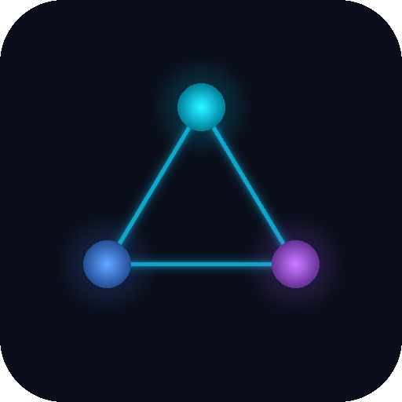

<p align="center">
  
</p>

<h1 align="center">NexusLink</h1>
<p align="center">个人社交人脉管理系统 — 记录联系人、互动、生日，维护你的每一段关系。</p>

## Features

- **联系人管理** — 丰富的个人档案（MBTI、星座、性格特征、个人长处等）
- **多条目联系方式** — 微信、邮箱等自由组合，独立存储
- **互动时间线** — 支持单人/多人互动记录，含情绪追踪
- **线上互动打卡** — 拖拽式日常线上互动记录，每日一条去重
- **生日提醒** — 支持农历/公历，保存联系人时自动同步，到期自动滚动至下一年
- **数据仪表盘** — Chart.js 驱动的多维度统计分析
- **标签系统** — 灵活的联系人分组与筛选
- **暗色赛博主题** — Tailwind CSS 定制的科技感界面
- **移动端适配** — 响应式设计，底部导航栏

## Tech Stack

| Layer | Technology |
|-------|------------|
| Backend | Node.js, Express |
| Frontend | Vanilla JS, Tailwind CSS, Chart.js |
| Database | SQLite (better-sqlite3, WAL mode) |
| Calendar | lunar-javascript（农历/公历互转） |

## Getting Started

```bash
# Install dependencies
npm install

# Start the server
npm start
```

The app runs at `http://localhost:3000`. A SQLite database is auto-created in `data/app.db` with sample seed data on first launch.

## Database Schema

```
contacts            — 联系人主表
contact_methods     — 联系方式（微信/邮箱等，一对多）
tags                — 标签
contact_tags        — 联系人-标签关联
interactions        — 互动记录
interaction_contacts — 互动-联系人关联（支持多人）
reminders           — 生日提醒（自动管理）
online_pings        — 线上互动打卡（日期+联系人去重）
contact_strengths   — 个人长处记录
settings            — 系统设置
```

## API Endpoints

| Resource | Methods | Path |
|----------|---------|------|
| Contacts | GET, POST, PUT, DELETE | `/api/contacts` |
| Contact Methods | (embedded in contact CRUD) | — |
| Tags | GET, POST, DELETE | `/api/tags` |
| Contact Tags | POST | `/api/contacts/:id/tags` |
| Interactions | GET, POST, DELETE | `/api/interactions` |
| Reminders | GET, PUT | `/api/reminders` |
| Online Pings | GET, POST, DELETE | `/api/pings` |
| Strengths | GET, POST, PUT, DELETE | `/api/contacts/:id/strengths` |
| Stats | GET | `/api/stats/*` |
| Settings | GET, PUT, DELETE | `/api/settings/*` |
| Lunar Convert | GET | `/api/lunar/convert` |

## Project Structure

```
├── public/                  # Frontend
│   ├── index.html           # SPA entry point
│   ├── icon.png             # App icon (1024x1024)
│   ├── favicon.svg          # SVG favicon
│   ├── css/style.css        # Cyber-tech theme
│   └── js/
│       ├── api.js           # API client
│       ├── app.js           # App entry & routing
│       ├── contacts.js      # Contacts module
│       ├── dashboard.js     # Dashboard (Chart.js)
│       ├── lunar.min.js     # Lunar calendar (UMD)
│       ├── reminders.js     # Birthday reminders
│       ├── settings.js      # Settings module
│       ├── timeline.js      # Timeline + online pings
│       └── utils.js         # Shared utilities
├── server/                  # Backend
│   ├── index.js             # Express server
│   ├── db.js                # Database schema & seeds
│   └── routes/
│       ├── contacts.js      # Contacts CRUD + birthday sync
│       ├── interactions.js  # Multi-person interactions
│       ├── pings.js         # Online ping tracking
│       ├── reminders.js     # Birthday auto-roll
│       ├── settings.js      # Record start date
│       ├── stats.js         # Analytics queries
│       ├── strengths.js     # Personal strengths
│       └── tags.js          # Tag management
├── data/                    # SQLite DB (auto-created, gitignored)
├── package.json
└── LICENSE
```

## Deployment (Railway)

1. Fork or connect this repo to [Railway](https://railway.app)
2. Railway auto-detects Node.js and runs `npm install` + `npm start`
3. Add a **Volume** (mount path: `/data`) for SQLite persistence
4. Set environment variables:

| Variable | Value | Description |
|----------|-------|-------------|
| `DB_PATH` | `/data/nexus.db` | Database file path (on Volume) |
| `NODE_ENV` | `production` | Production mode |

5. In **Settings → Networking**, click **Generate Domain** to get a public URL

## Icon Design

<p align="center">
  
</p>

**设计理念**: 三个发光节点由霓虹线条连接，构成三角形星座图案，象征人与人之间的社交连接网络。

- **配色**: 从霓虹蓝 `#00d4ff` 到紫色 `#a855f7` 的渐变，与应用内的赛博朋克主题一致
- **背景**: 深色 `#0a0e1a`，保持与 UI 的视觉统一
- **风格**: 赛博朋克极简 — 干净的几何线条 + 节点光晕，无文字
- **寓意**: 三个节点代表不同的联系人，连接线代表互动关系，三角形结构象征稳固的社交网络

## License

This project is licensed under the [MIT License](LICENSE).
